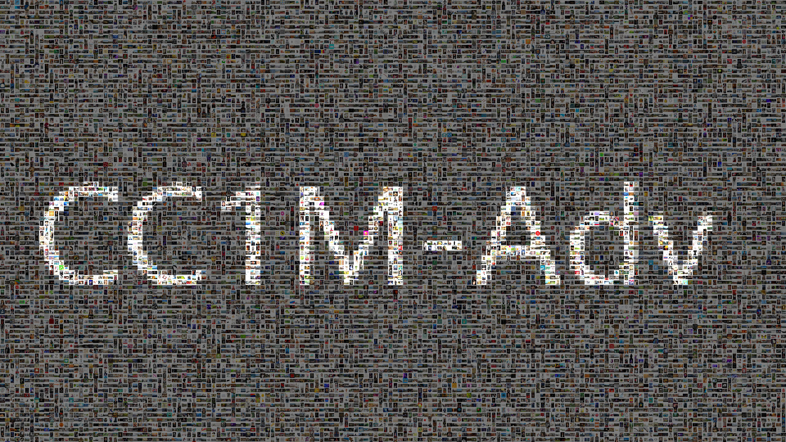

# CC1M-Adv-C/F: Million-Scale Datasets for Adversarial Robustness Evaluation
  
<p align="center">
</img>
</p>

Current evaluations of adversarial robustness for vision models are mostly small-scale, often based on subsets of CIFAR-10 or ImageNet. We believe that large-scale (million-scale) assessments are crucial for advancing the field. To facilitate large-scale adversarial robustness testing for vision models, we have constructed a dataset called CC1M based on **CC3M**[1], by removing outlier images (based on the LID metric) and sampling one million images. Subsequently, based on CC1M, we have created two adversarial version of CC1M: **CC1M-Adv-C** and **CC1M-Adv-F**, using the following methods:

- **Probability Margin Attack (PMA)**[2], our newly proposed attack method for image classification models that is based on a probability margin loss.

- **Improved Transferability**: we improve the transferability by proposing a **Surrogate Ensemble** technique, generating based on an ensemble (eight) of surroagte models.

- **CC1M-Adv-C** is for testing image classification models, while **CC1M-Adv-F** is for non-classification models.

- Example evaluations can be found at our Vision Safety Platform: https://github.com/OpenTAI/taiadv/blob/main/taiadv/vision.

<br>
<br>

## CC1M
### Dataset Description
CC1M is a large-scale evaluation dataset containing 1 million images selected from the CC3M, which consists of image-caption pairs featuring diverse objects, scenes, and visual concepts. To construct CC1M, we first removed unavailable images, such as those displaying “this image is unavailable” due to expired URLs. Next, we filtered out noisy images that lack meaningful semantic content, such as random icons. To further refine the dataset, we applied the Local Intrinsic Dimensionality (LID) metric, known for detecting adversarial images, backdoor images, and low-quality data that may harm self-supervised contrastive learning. By calculating LID scores based on CLIP embeddings, we identified outliers using the Median Absolute Deviation (MAD) method, retaining images with LID scores close to the median. This process ensures that the final CC1M dataset maintains high-quality, diverse content suitable for robust evaluation tasks.

### File Structure
```
cc1m
    |--000000000.jpg
    |--000000001.jpg
    |--000000002.jpg
    ...
```


## CC1M-Adv-C
### Dataset Description
We focus on image classification models and introduce a novel attack method called **Probability Margin Attack (PMA)**, which defines the adversarial margin in the probability space instead of the logits space. Using PMA, we generate highly transferable adversarial examples, termed CC1M-Adv-C, by perturbing noise to simultaneously affect multiple classification models. To create these adversarial examples, we employed four surrogate models from the RobustBench library, encompassing various architectures and defense strategies. The table below provides an overview of the models used.

| Surrogate model | paper |
| --- | --- |
| Swin-L | A comprehensive study on robustness of image classification models: Benchmarking and rethinking |
| ConvNeXt-L | A comprehensive study on robustness of image classification models: Benchmarking and rethinking |
| ViT-B + ConvStem | Revisiting adversarial586 training for imagenet: Architectures, training and generalization across threat models |
| RaWideResNet-101-2 | Robust principles: Architectural design principles for adversarially robust cnns |


### File Structure

```
cc1m_adv_c
    |--000000000.jpg
    |--000000001.jpg
    |--000000002.jpg
    ...
```

### Download
https://huggingface.co/datasets/xingjunm/CC1M-Adv-C

### Usage
This dataset can be used with the code we provide to test the relative robustness of the model.
Our robustness evaluation code can be found at: https://github.com/OpenTAI/taiadv/blob/main/taiadv/vision/white-box

<br>
<br>

## CC1M-Adv-F
### Dataset Description
We generate highly transferable adversarial examples by perturbing in parallel at the feature layer using multiple pre-trained image encoders.
We selected 8 mainstream feature extractors from the timm library for generating adversarial examples, which include various model architectures and pre-training methods. The following table shows the models we used.
| model name | paper |
| --- | --- |
| vgg16 | Very deep convolutional networks for large-scale image recognition|
| resnet101 | Deep residual learning for image recognition|
| efficient net | Efficientnet: Rethinking model scaling for convolutional neural networks|
| convnext_base | A convnet for the 2020s|
| vit_base_patch16_224 | An image is worth 16x16 words: Transformers for image recognition at scale|
| vit_base_patch16_224.dino | Emerging properties in self-supervised vision transformers|
| beit_base_patch16_224 |Beit: Bert pre-training of image transformers|
| swin_base_patch4_window7_224 | Swin transformer: Hierarchical vision transformer using shifted windows|


### File Structure

```
cc1m_adv_f
    |--000000000.jpg
    |--000000001.jpg
    |--000000002.jpg
    ...
```

### Download
https://huggingface.co/datasets/xingjunm/CC1M-Adv-F

### Usage
This dataset can be used with the code we provide to test the relative robustness of the model.
Our robustness evaluation code can be found at: https://github.com/OpenTAI/taiadv/blob/main/taiadv/vision/black-box
<br>
<br>
## Acknowledgements
Our work is based on the CC3M dataset.
website: https://ai.google.com/research/ConceptualCaptions/
paper: https://aclanthology.org/P18-1238/
github: https://github.com/google-research-datasets/conceptual-captions
<br>
<br>
## Cite Us
If you find our datasets interesting and helpful, please consider citing us in your research or publications:
